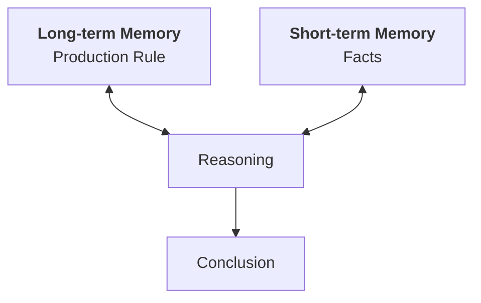
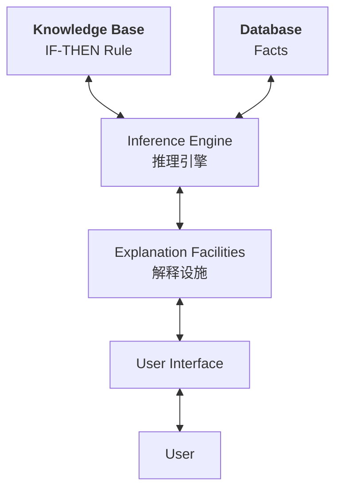
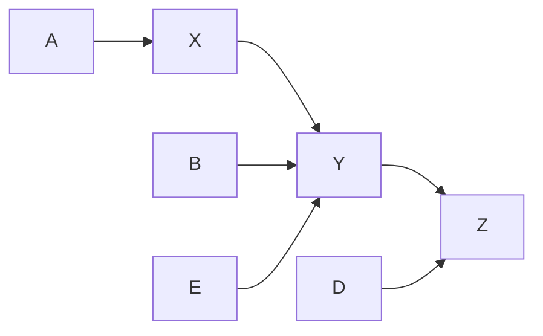
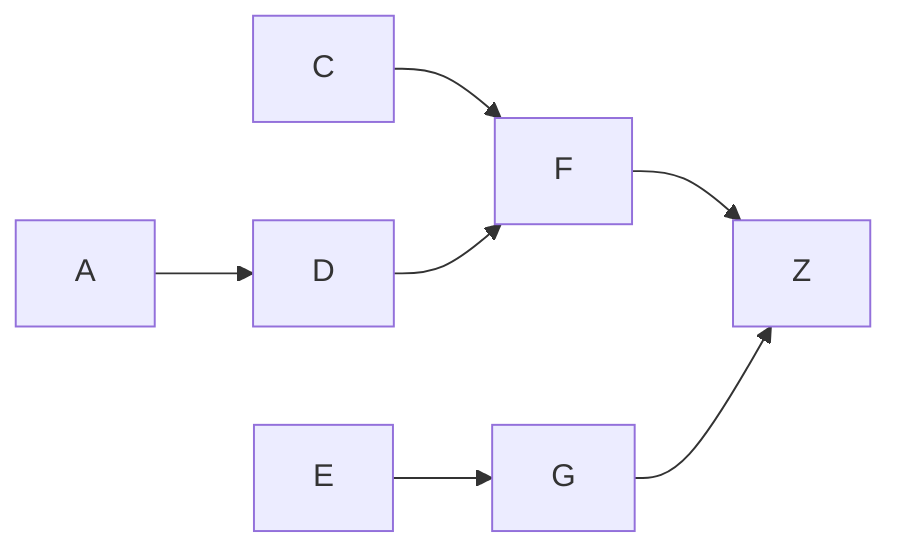
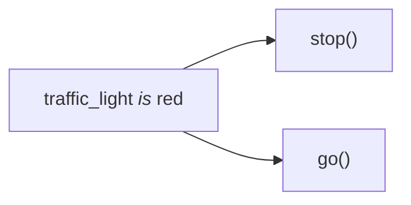

# 2.0 Knowledge
## 2.0.1 What is knowledge?
- [i] Knowledge is:
	- A theoretical/partial understanding of a subject/domain.
	- The sum of what's currently known.
- [i] A domain expert is someone who possesses:
	- Deep knowledge (facts and rules) and
	- Strong practical experience 
- ... in a particular domain, whose area may be limited.
## 2.0.2 Why do we need rules?
- [i] The human mental process is internal.
	- It is too complex to be represented as an algorithm.
	- Experts can express knowledge in the form of **rules** for problem solving.

# 2.1 Rules
## 2.1.1 What is a rule?
- An $\text{IF}$-$\text{THEN}$ structure
- Relates given information to some actions.
	- i.e., Relates $\text{IF}$ part to $\text{THEN}$ part.
- Provides some description on "how to solve a problem".
## 2.1.2 Structure of a rule
- **Antecedent (Premise/Condition) 前因:** The $\text{IF}$ part
	- Object: A thing to describe.
	- Operator: Identifies an object, assigns a value.
	- Value: Symbolic / Numeric.
- **Consequent (Conclusion/Action) 后果:** The $\text{THEN}$ part
	- Actions
- Example:
```
IF customer_age > 18
THEN sell_wine()
```
## 2.1.3 Joined Antecedents
A rule can have multiple antecedents joined by:
- $\text{AND}$ (Conjunction), and
- $\text{OR}$ (Disjunction),
- or both.
Example:
```
IF customer_age < 18
AND cash_withdrawal > 1000
THEN require(parent_signature)
```
## 2.1.3 Usage of a rule
Rules can represent:
### Relation
```
IF fuel_tank is empty
THEN conclude("car is dead")
```
### Recommendation
```
IF season is autumn
AND sky is cloudy
AND forecast is drizzle
THEN advice("take umbrella")
```
### Directive
```
IF car is dead
AND fuel_tank is empty
THEN refuel(car)
```
### Strategy
```
IF car is dead
THEN check(fuel_tank), complete(step_1)

IF step_1 is complete
AND fuel_tank is full
THEN check(battery), complete(step_2)
```
### Heuristic
```
IF spill is liquid
AND spill_ph < 6
AND spill_smell is vinegar
THEN conclude("spill_material is acetic acide")
```

# 2.2 Rule-based Expert System
## 2.2.1 Personnel in the development team
1. Domain Expert
2. Knowledge Engineer
3. Programmer
4. Project Manager
5. End-user

## 2.2.2 Structure of a rule-based expert system
### Production System Model: An Abstract
- Promoted by Newell and Simon from Carnegie-Mellon University.
- Idea:
	- Apply given knowledge (in the form of production rules) to a problem,
	- which is represented by problem-specific information.
- Property:
	- Production rules are stored in the long-term memory.
	- The problem-specific information (facts) are stored in the short-term memory.


### Rule-Based Expert System: Basic Structure
- **Knowledge Base 规则库**
	- Contains domain knowledge.
	- Knowledge is represented as a set of rules.
		- Each rule specifies a relation/recommendation/directive/strategy/heuristic.
		- Each rule has the $\text{IF}-\text{THEN}$ structure.
	- When the condition part of a rule is satisfied:
		- The rule would **fire**, and the action part is executed.
		- Once the action is created, new facts will be generated.
- **Database 事实库**
	- Contains a set of facts.
	- Facts are used to match against the $\text{IF}$ parts of rules stored in the knowledgebase.
- **Inference Engine 推理引擎**
	- *Performs the Reasoning*
	- Carries out the reasoning, and reach a **solution**.
		- Links rules from knowledge base and facts in database.
		- Compares fact and the $\text{IF}$ part of rules.
		- When the $\text{IF}$ part of the rule matches some facts in the database:
			- **Fire** the rule, execute the $\text{THEN}$ part.
			- The rule generates new facts.
- **Explanation Facilities 解释设施**
	- *Explains the Reasoning*
	- Enables user to ask the expert system:
		- how, a particular conclusion is reached, and
		- why, a specific fact is needed.



# 2.3 Forward & Backward Chaining
## 2.3.0 What is "Chaining"?
- As mentioned in [[#2.2.2 Structure of a rule-based expert system]]:
	- The inference engine matches facts in the database and fire rules whose $\text{IF}$ parts matches to some of the facts, producing new facts.
- The matching of $\text{IF}$ parts of the rules to the facts produces **Inference Chains推理链条**.
	- Inference chains indicates how an expert system applies the rules to reach a conclusion.
### Example: A set of rules
Rule set:
```
Rule 1: IF Y is true
		AND D is true
		THEN Z is true
		
Rule 2: IF X is true
		AND B is true
		AND E is true
		THEN Y is true

Rule 3: IF A is true
		THEN X is true
```
Graph of the rule set:

## 2.3.1 Forward Chaining 正向连锁
- [i] Data-Driven Reasoning
	- *Given the rules, find the goal.*
	- Reasoning starts from the known data, and proceeds with it.
- In each iteration:
	- Proceeds forward with known data, execute rules to get new facts. 
		- *Any rule can be executed only once.*
	- Store new fact in the database.
- Then use the new fact to do get other facts in the next iteration.
### Forward Chaining: An example
Known facts:
- $A,B,E,D$
Given Rules:

Inference Process:

| Iter | Known Facts                                                          | Rules Fired                                                    | New Facts           | Remarks                    |
| :--: | :------------------------------------------------------------------- | :------------------------------------------------------------- | :------------------ | :------------------------- |
|  0   | $\text{A}, \text{B}, \text{E}, \text{D}$                             |                                                                |                     | Initial State              |
|  1   | $\text{A}, \text{B}, \text{E}, \text{D}$                             | $\text{A}\rightarrow \text{X}$, $\text{B}\rightarrow \text{Y}$ | $\text{X},\text{Y}$ |                            |
|  2   | $\text{A}, \text{B}, \text{E}, \text{D},\text{X},\text{Y}$           | $\text{D}\rightarrow \text{Z}$                                 | $\text{Z}$          |                            |
|  3   | $\text{A}, \text{B}, \text{E}, \text{D},\text{X},\text{Y}, \text{Z}$ |                                                                |                     | No more rules to be fired. |
### Forward Chaining: Summary
- Forward chaining is a technique for:
	- First gathering information,
	- and then inferring from it.
- However, many rules may be executed.
	- Where most of them has nothing to do with the established goal.
- Therefore:
	- If our goal is to infer only *one particular fact*, forward chaining inference would not be efficient.

## 2.3.2 Backward Chaining 反向连锁
- [i] Goal-Driven Reasoning
	- *Given the goal, find the rules to prove this goal.*
	- An expert system has the goal
	- The inference engine attempts to **find the evidence** to prove it.
- In each iteration:
	- Search knowledge base to find rules that might prove the goal.
	- If such rules is found, search for their $\text{IF}$ parts in the database.
		- If the $\text{IF}$ parts is matched, the goal is proved.
		- Otherwise, attempt to find rules that produces that particular $\text{IF}$ part, and so on. (In a recursive manner)
### Backward Chaining: An Example
Known Facts:
- $\text{A},\text{B},\text{C},\text{E}$
Given Rules:

Backward-Chaining Stack Trace:
```
Given A, B, C, E.
Start.
	try F --> Z,           (Can't find F)
		try C & D --> Z,   (Can't find D)
		try A --> D.       (Satisfied)
	try G --> Z,           (Can't find G)
		try E --> G.       (Satisfied)
End.
```

# 2.4 Conflict Resolution
## 2.4.0 What's the problem?
- [i] In fact, it is possible to have two rules conflicting.
```
Rule 1: IF traffic_light is red
		THEN stop()
		
Rule 2: IF traffic_light is red
		THEN go()
```
With the graph:

- `Rule 1` and `Rule 2` shares the same $\text{IF}$ part.
	- Thus, both of them can be set to fire when their common $\text{IF}$ part is satisfied.
	- These rules represents a **Conflict Set**.
- In forward chaining, both rules will be fired together if no resolution is made.
	- In this case, `Rule 3` will be fired after `Rule 2` in sequence.
	- Therefore, the action `go()` will overwrite the action `stop()`.

- The inference engine must decide which rule to fire from such a set.
	- A method for choosing a rule to fire from a conflict set in a cycle is called **Conflict Resolution**.

## 2.4.1 Conflict Resolution Methods
### 1. Highest Priority
- [i] Fire the rules with the highest priority.
	- Priorities can be established by placing rules in an appropriate order in the knowledge base.
	- Works well with expert systems with ~100 rules.
### 2. Most Specific
- [i] Fire the rules that's the most specific.
	- Also known as the *longest matching strategy*.
	- It is based on the assumption that:
		- A specific rule processes more information than a general one.
```
Given:
	A & B -> C
	A -> !C
Choice:
	A & B -> C
Reason:
	A & B is more specific thant A itself.
```
### 3. Most Recently Added
- [i] Fire the rule that uses the fact that's most recently entered in the database.
	- That is, to use the *newest facts*.
	- This method relies on time tags attached to each fact in the database.
### 4. Metaknowledge
- [i] Knowledge about Knowledge
	- About the use & control of domain knowledge in an expert sys.
- [i] Metaknowledge is represented by **Metarules**.
> **Metarule 1:**
> Rules supplied by experts are prioritized over the ones supplied by novices.
> ....

# 2.5 Pros & Cons
## 2.5.1 Advantages
- [p] Natural Knowledge Representation.
- [p] Uniform $\text{IF}$-$\text{THEN}$ Structure.
	- Each $\text{IF}$-$\text{THEN}$ Structure is an independent piece of knowledge.
- [p] Separation of *Knowledge Base* from *Inference Engine*.
	- Can develop different applications with the same expert system structure.
- [p] Good at coping *Incomplete* & *Uncertain* Knowledge

## 2.5.2 Disadvantages
- [c] Opaque Relations between Rules in a large Knowledge Base.
	- Difficult to observe how individual rules server the overall strategy once the knowledge base gets large.
- [c] Ineffective search strategy.
	- The inference engine applies an exhaustive search through all production rules during each iteration.
	- Therefore, expert systems with a large set of rules can be slow, and thus incompatible with real-time applications.
- [c] Inability to learn.
	- *Rules can't be adjusted, and new rules can't be added either.*
	- Can't modify the knowledge base, thus can't learn from experience.
	- This means that the knowledge engineer is responsible for revising the system. This is manual learning instead of machine learning.
