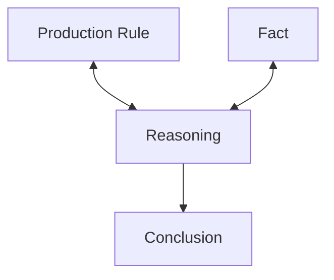
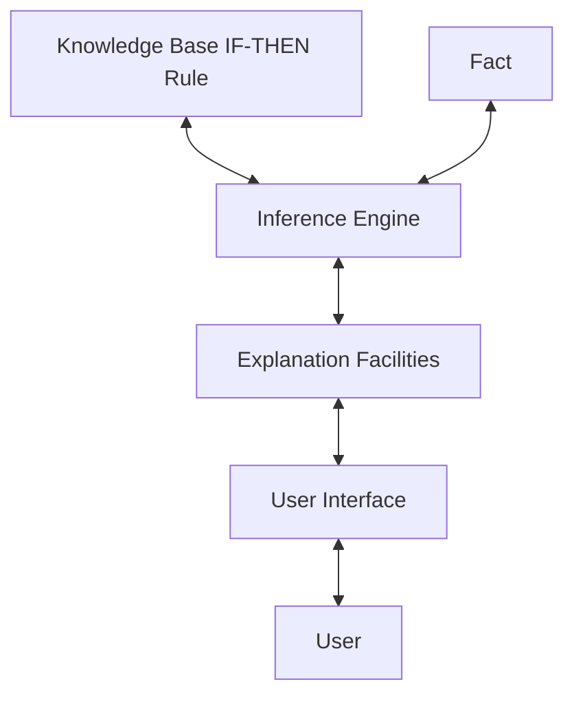
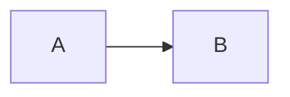
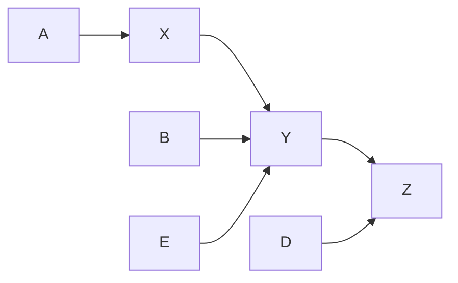
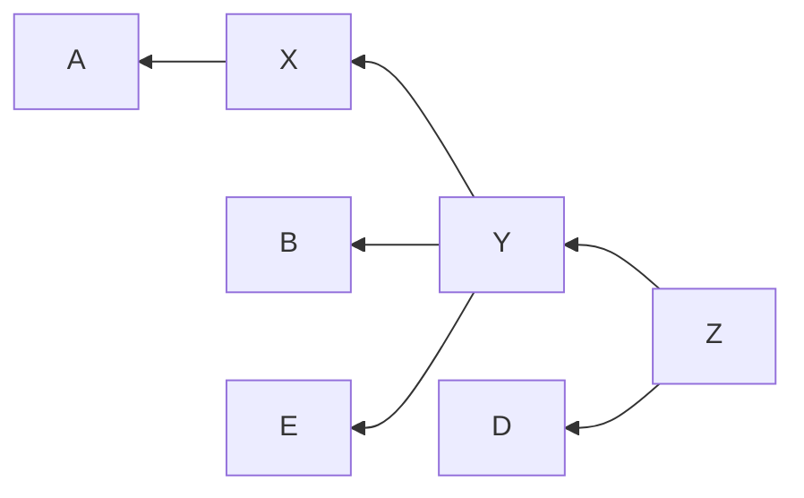
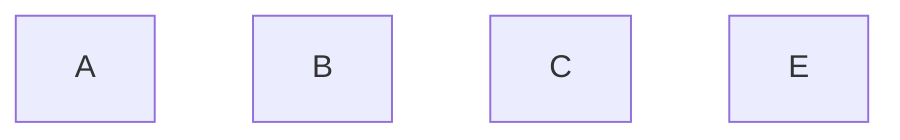
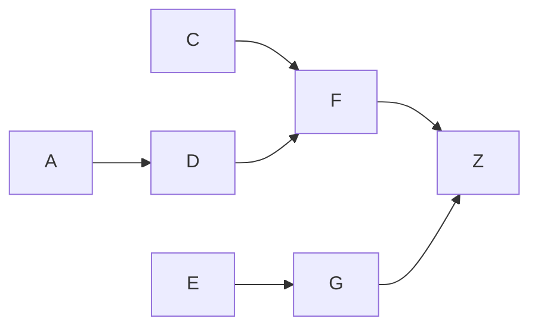

# 2.1 [DEF] Rules
## 2.1.1 What is a rule
- An IF-THEN structure
- Relates given information to some actions.
- Relates IF part to THEN part.

## 2.1.2 Structure of a rule
- **Antecedent 前因:** The IF part
	- Object
	- Operator: Identifies an object, assigns a value
	- Value: Symbolic / Numeric
- **Consequent 后果:** The THEN part
	- Actions
- Example:
```
IF customer_age < 18
AND cash_withdrawal > 1000
THEN require(parent_signature)
```

## 2.1.3 Usage of a rule
	Rules can represent:
- Relations
- Recommendations
- Directives
- Strategies
- Heuristics

# 2.2 Rule-based Expert System
## Production System Model


## Rule-Based Expert System: Basic Structure



# 2.3 Forward & Backward Chaining
### Example: A set of rules
Legend: If (A) then (B)


Graph of the rule set

Process: 
- Every cycle, don't use the fact derived in this cycle yet.
- Use BFS instead of DFS

| Known               | Rules Fired                          | Notes           |
| ------------------- | ------------------------------------ | --------------- |
| A, B, E, D          |                                      |                 |
| A, B, E, D, X, Y    | A $\rightarrow$ X, B $\rightarrow$ Y | Don't use X yet |
| A, B, E, D, X, Y, Z | D $\rightarrow$ Z                    |                 |

## 2.3.1 [DEF] Forward Chaining
- Data-Driven Reasoning
	- Given the rules, find the goal.
- Role:
	- Reasoning starts from the known data.
	- Proceeds forward with known data, execute rules to get new facts. *Any rule can be executed only once.*
	- Store new fact in the database.
	- Then use the new fact to do get other facts.

Graph of the rule set


## 2.3.2 [DEF] Backward Chaining
- Goal-Driven Reasoning
	- Given the goal, find the rules.
- Roles
	- An expert system has the goal
	- The inference engine attempts to **find the evidence** to prove it.

Graph of the rule set


An Example process of Backward Chaining:
Facts:

Rules:


Backward-Chaining Stack Trace:
```
Given A, B, C, E.
Start.
	try F --> Z  (Can't find F)
		try C & D --> Z   (Can't find D)
		try C & A --> Z   (Satisfied)
	try G --> Z  (Can't find G)
		try E --> Z   (Satisfied)
End.     
```


# 2.4 Conflict Resolution

## 2.4.1 Methods
1. Highest-Priority
2. Most-Specific (Longest Matching Strategy)
```
Given:
	A & B -> C
	A -> !C
Choice:
	A & B -> C
Reason:
	A & B is more specific thant A itself.
```
3. Most-recently Entered

## 2.4.2 Metaknowledge 
- Knowledge about Knowledge
- About the use & control of domain knowledge in an expert sys.
- In rule-based expert systems: Metarules


# 2.5 Pros & Cons
## 2.5.1 Advantages
- **Natural Knowledge Representation**
- **Uniform Structure**
	- Each IF-THEN structure is an independent piece of knowledge.
- **Separation of knowledge & Processing**
- **Good for Incomplete & Uncertain Knowledge**

## 2.5.2 Disadvantages
- **Opaque Relations between Rules**
- **Ineffective search strategy**
- **Inability to learn**
