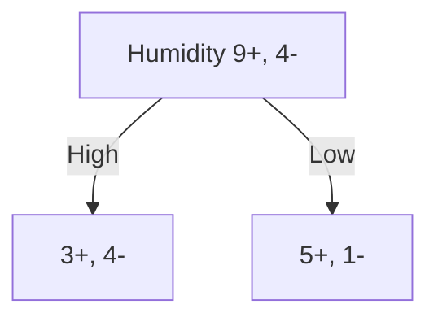

# 5.1 Introduction
## 5.1.1 A sample decision tree

## 5.1.2 Properties of Decision Tree Learning
- Decision Tree Learning is a method for approximating discrete-valued functions that is
	- Robust to noisy data and
	- can learn disjunctive expressions
- The learned function is represented by a decision tree.
	- which can be also represented by a set of if-then rules
- In General
	- Decision Trees represent a **disjoint** of conjunctions of constraints on the attribute value of instance.
		- disjoint = a set of $\lor$
	- Each path from the tree from root to a leaf is a **conjunction** of attribute sets.
		- conjunction = a set of $\land$
		- $e.g.,$ The path $Outlook\rightarrow Humidity\rightarrow No$ stands for $Outlook=Sunny \land Humidity=High \rightarrow No$

## 5.1.3 Appropriate Problems for DT
1. Instances describable by attribute-value pairs.
	1. e.g., Temperature=Hot, Humidity=High, etc.
2. Target function has discrete output values.
	1. e.g., Yes/No, Is Owner/Not owner, etc.
3. Disjunctive hypothesis may be required.
	1. That is, the hypothesis is in the format of "xxx or xxx or xxx...."
4. Possibly noisy training data.
5. Missing attribute values in training data.

# 5.2 Symbolized Decision Tree
## 5.2.1 Attributes & Purity of Decision
- We want to know which attribute is the best classifier.
- Each attribute can be represented as a node, splitting test sample into 2 classes (in the binary case)
- The *purer* the splitting, the better the decision.
## 5.2.2 Entropy 熵
**[DEF] Entropy 熵**
- Given **a split** from collection $S$ with **portions** of both positive and negative $p_+, p_-$, 
  the entropy of the collection would be:
	- $Entropy(S)=-p_+\log_2p_+-p_-\log_2p_-$
- The higher the entropy, the fewer the information the sample contains.
	- High Entropy = More Messy, Lower Entropy = Less Messy 
	-  ![[2-Split Entropy.png]]
	- $f(p)=-p\log_2p-(1-p)\log_2(1-p)$

**[Prop] Entropy 熵的性质**
- Domain is $[0,1]$;
	- Monotonically, Increase in $p_+\in[0,\dfrac{1}{2}]$, Decrease in $p_+\in[\dfrac{1}{2},1]$ (symmetric in $p_-$);
- Range is $[0,1]$;
	- Reaches the peak at $p=\dfrac{1}{2}$, reaches the lowest point at $p_+=0$ and $p_+=1$.

## 5.2.3 Information Gain
By calculating the difference between
- The entropy **BEFORE** splitting, and
- The entropy **AFTER** splitting,
we can calculate the "Information Gained" from the splitting.
- When calculating, we should also consider the weights, i.e., the significance of each branch.

**Basics**
- Suppose that a collection $S$ has $x=|S|$ samples, separated into $n$ branches $S_1,S_2,\cdots,S_n$. For a specific branch $S_i$, it contains $x_i=|S_i|$ samples.
	- $x=x_1+x_2+\cdots+x_n$
- Among the $x$ samples, there are $x_+$ positive samples and $x_-$ negative samples.
	- $x=x^++x^-$
- For each branch $x_i$, there are $x_+^i$ positive samples and $x_-^i$ negative samples.
	- $x_i=x_i^++x_i^-$
	- Obviously, $x^+=\sum_{i=1}^{n}x_i^+$, and $x^-=\sum_{i=1}^{n}x_i^-$

**Entropy Before Split**
- $p_+=\dfrac{x^+}{x^++x^-}$, $p^-=\dfrac{x^-}{x^++x^-}$
- $Entropy(S)=-p^+\log_2p^+-p^-\log_2p^-$

**Weighted Entropy After Split**
- For each branch $S_i$:
	- $p_i^+=\dfrac{x_i^+}{x_i^++x_i^-}$, $p_i^-=\dfrac{x_i^-}{x_i^++x_i^-}$
	- Weight of this branch $w_i=\dfrac{x_i}{x}=\dfrac{|S_i|}{|S|}$
	- Entropy of this branch $Entropy(S_i)=-p_i^+\log_2p_i^+-p_i^-\log_2p_i^-$
- Total weighted entropy after split:
	- $\sum_{i=1}^{n} \dfrac{x_i}{x}(-p_i^+\log_2p_i^+-p_i^-\log_2p_i^-)$
	- $=\sum_{i=1}^{n}\dfrac{|S_i|}{|S|}Entropy(S_i)$

**Information Gain**
- $Gain(S)=Entropy \ Before \ Split \ - \ Entropy \ After \ Split$
- $=Entropy(S)-\sum_{i=1}^{n}\dfrac{|S_i|}{|S|}Entropy(S_i)$
## 5.2.4 From Entropy to Information Gain
Given:
- A decision node, with the amounts in each class:
	- Collection 1 ($S_1$):
		- Positive: $n_1^{+}$
		- Negative: $n_1^{-}$
	- Collection 2 ($S_2$):
		- Positive :$n_2^{+}$
		- Negative: $n_2^{-}$
- Example:
	- $n_1^+=3, n_1^-=4$
	- $n_2^+=6, n_2^-=1$

Do:
- Get the proportion of positive & negative samples in both collections.
	- $S_1$: 
		- $p_1^+=\dfrac{n_1^+}{n_1^++n_1^-}=\dfrac{3}{3+4}=\dfrac{3}{7}$ 
		- $\ p_1^-=\dfrac{n_-^1}{n_+^1+n_-^1}=\dfrac{4}{3+4}=\dfrac{4}{7}$
	- $S_2$: 
		- $p_2^+=\dfrac{n_2^+}{n_2^++n_2^-}=\dfrac{5}{5+1}=\dfrac{5}{6}$ 
		- $p_2^-=\dfrac{n_2^-}{n_2^++n_2^-}=\dfrac{1}{5+1}=\dfrac{1}{6}$
- Calculate Entropies:
	- Calculate entropy **AFTER** splitting:
		- $Entropy(S_1)=-p_1^+\log_2{p_1^+}-p_1^-\log_2{p_1^-}=-\dfrac{3}{7}\log_2\dfrac{3}{7}-\dfrac{4}{7}log_2\dfrac{4}{7}=0.9852$
		- $Entropy(S_2)=-p_2^+\log_2{p_2^+}-p_2^-\log_2{p_2^-}=-\dfrac{5}{6}\log_2\dfrac{5}{6}-\dfrac{1}{6}log_2\dfrac{1}{6}=0.6500$
	- Calculate overall **BEFORE** splitting:
		- $p^+=\dfrac{n^+}{n^++n^-}=\dfrac{9}{9+4}=\dfrac{9}{13}$
		- $p^-=\dfrac{n^-}{n^++n^-}=\dfrac{4}{9+4}=\dfrac{4}{13}$
		- $Entropy(S)=-p_+log_2{p_+}-p_-log_2{p_-}=-\dfrac{9}{13}\log_2\dfrac{9}{13}-\dfrac{4}{13}\log_2\dfrac{4}{13}=0.8905$
- Calculate Information Gain:
	- $Gain(S)=Entropy(S)-\sum_{i\in\{1,2\}}\dfrac{|S_i|}{|S|}Entropy(S_i)$
	- $=0.8905-(\dfrac{7}{13}\times0.9852+\dfrac{6}{13}\times0.6500)$
	- $=0.0600$

# 5.3 CART

### 5.3.0 What is CART?
- Classification and Regression Tree
- A binary tree that can handle numeric inputs and outputs.

## 5.3.1 Gini Index 基尼指数
For a split $S_i$ from collection $S$ that has results with $m$ labels:
- $|S_i|=x_{i1}+x_{i2}+\cdots+x_{im}$

The Gini Index of this split is:
- $Gini(S)=1-\sum_{j=1}^{m}{(p_{ij})}^2$
	- $=1-\sum_{j=1}^{m}(\dfrac{x_{ij}}{x_{i1}+x_{i2}+\cdots+x_{im}})^2$
	- $=1-\dfrac{\sum_{j=1}^{m}x_{ij}^2}{|S_i|^2}$

Reaches maximum when $p_{ij}=\dfrac{1}{m}$
- $Gini(S)_{max}=1-m\times(\dfrac{1}{m})^2=1-\dfrac{1}{m}$
- For a binary case, $Gini(S)_{max}=\dfrac{1}{2}$
![[2-Split Gini Index.png]]
## 5.3.2 Classification Tree (CT)
### How to split continuous variable?
- Sort the continuous variable.
- Find all separation points that separates the continuous variable into lower and higher parts.
- Select the separation point $\alpha$ that gives the best purity.

### How to split categorical variable?
- Examine all possible ways in which the categories can be split.
- For example, for each possible category $A$, $B$$ and C$, it could be split 3 ways:
	- $A$ and $BC$
	- $B$ and $AC$
	- $C$ and $AB$
- Find the split that gives the best purity.

### E(5.3.2) Example
Classify if an email is spam or not.

| Word Count (Numeric) | Sender's Email | Contain word "Free" | Spam |
| -------------------- | -------------- | ------------------- | ---- |
| 100                  | Edu            | Yes                 | Yes  |
| 200                  | Com            | Yes                 | No   |
| 800                  | Edu            | Yes                 | No   |
| 60                   | Org            | No                  | Yes  |
| 40                   | Edu            | No                  | Yes  |
| 300                  | Org            | No                  | Yes  |
| 300                  | Edu            | Yes                 | No   |
| 300                  | Com            | Yes                 | No   |
#### E(5.3.2)-1 Word Count (Numerical)
**1. Sort the word count.**
`40, 60, 100, 200, 300, 300, 300, 800`
`Y,  Y,   Y,   N,   Y,   N,   N,   N`

**2. Find $\alpha$**
Entropy Before Split:
$E=-\dfrac{4}{8}\log_2{\dfrac{4}{8}}-\dfrac{4}{8}\log_2{\dfrac{4}{8}}=1$

Entropy After Split for each separation points:
- `40|60`, $\alpha=\dfrac{40+60}{2}=50$.
	- $<50$:  $+:1$, $-:0$,    $E_{x<50}= -1\log_2{1}-0\log_2{0} = 0$
	- $>50$:  $+:3$, $-:4$,    $E_{x>50}=-\dfrac{3}{7}\log_2{\dfrac{3}{7}}-\dfrac{4}{7}\log_2{\dfrac{4}{7}}=0.9852$
	- $IG_{\alpha=50}=1-(\dfrac{1}{8}\times0+\dfrac{7}{8}\times0.9852)=0.13795$

- `60|100`, $\alpha=\dfrac{60+100}{2}=80$.
	- $<80$:  $+:2$, $-:0$    $E_{x<80}= -1\log_2{1}-0\log_2{0} = 0$
	- $>80$:  $+:2$, $-:4$    $E_{x>80}= -\dfrac{2}{6}\log_2{\dfrac{2}{6}}-\dfrac{4}{6}\log_2{\dfrac{4}{6}} = 0.9183$
	- $IG_{\alpha=80}=1-(\dfrac{2}{8}\times0+\dfrac{6}{8}\times0.9183)=0.311275$

- `100|200`, $\alpha=\dfrac{100+200}{2}=150$.
	- $<150$:  $+:3$, $-:0$     $E_{x<150}= -1\log_2{1}-0\log_2{0} = 0$
	- $>150$:  $+:1$, $-:4$     $E_{x>150}= -\dfrac{1}{5}\log_2{\dfrac{1}{5}}-\dfrac{4}{5}\log_2{\dfrac{4}{5}} = 0.7219$
	- $IG_{\alpha=150}=1-(\dfrac{3}{8}\times0+\dfrac{5}{8}\times0.7219)=0.5488125$

- `200|300`, $\alpha=\dfrac{200+300}{2}=250$.
	- $<250$:  $+:3$, $-:1$   $E_{x<250}= -\dfrac{3}{4}\log_2{-\dfrac{3}{4}}-\dfrac{1}{4}\log_2{\dfrac{1}{4}} = 0.8113$
	- $>250$:  $+:1$, $-:3$   $E_{x>250}= -\dfrac{1}{4}\log_2{\dfrac{1}{4}}  -\dfrac{3}{4}\log_2{-\dfrac{3}{4}}= 0.8113$
	- $IG_{\alpha=250}=1-(\dfrac{4}{8}\times0.8113+\dfrac{4}{8}\times0.8113)=0.1887$

- `300|800`, $\alpha=\dfrac{300+800}{2}=550$.
	- $<550$:  $+:4$, $-:3$   $E_{x<550}= -\dfrac{4}{7}\log_2{-\dfrac{4}{7}}-\dfrac{3}{7}\log_2{\dfrac{3}{7}} = 0.9852$
	- $>550$:  $+:0$, $-:1$   $E_{x>550}= -0\log_2{0}-1\log_2{1} = 0$
	-  $IG_{\alpha=550}=1-(\dfrac{7}{8}\times0.9852+\dfrac{1}{8}\times0)=0.13795$

We can see that $\alpha=80$ that separates $60$ and $100$ gives the best split. Therefore, for the node $Word \ Count$, we choose $\alpha=80$, and $IG=0.5488125$ as the Information Gain of the root node.
#### E(5.3.2)-2 Sender's Email (Categorical)
Find all the possible splits.
$\{Edu\}: +:2, -:2$
$\{Com\}:  +:0, -:2$
$\{Org\}:  +: 2, -:0$

1. $\{Edu\}\cup\{Com, Org\}$
	1. $\{Edu\}$:  $+:2, -:2$,              $Entropy=1$
	2. $\{Com, Org\}$:  $+:2, -:2$,     $Entropy=1$
	3. $IG=1-(\dfrac{4}{8}\times1+\dfrac{4}{8}\times1)=0$
2. $\{Com\}\cup\{Edu, Org\}$
	1. $\{Com\}:  +:0, -:2$         $Entropy=0$
	2. $\{Edu, Org\}: + 4, -:2$     $Entropy=-\dfrac{4}{6}\log_2{\dfrac{4}{6}}-\dfrac{2}{6}\log_2{\dfrac{2}{6}}=0.9183$
	3. $IG=1-(\dfrac{2}{8}\times0+\dfrac{6}{8}\times0.9183)=0.311275$
3. $\{Org\}\cup\{Edu, Com\}$
	1. $\{Org\}:  +:2, -:0$         $Entropy=0$
	2. $\{Edu, Org\}: + 2, -:4$     $Entropy=-\dfrac{2}{6}\log_2{\dfrac{2}{6}-\dfrac{4}{6}\log_2{\dfrac{4}{6}}}=0.9183$
	3. $IG=1-(\dfrac{2}{8}\times0+\dfrac{6}{8}\times0.9183)=0.311275$

Both split $\{Com\}\cup\{Edu, Org\}$ and $\{Org\}\cup\{Edu, Com\}$ gives the highest information gain, which is $0.311275$. Therefore, the information gain of $Sender's \ Email$ is $0.311275$ for the root node.
#### E(5.3.2)-3 Contain word "Free" (Binary)
Binary Classification plays the same.
- $Yes$
	- $+:1, -:4$     $Entropy=-\dfrac{1}{5}\log_2{\dfrac{1}{5}}-\dfrac{4}{5}\log_2{\dfrac{4}{5}}=0.7219$
- $No$
	- $+:3, -:0$     $Entropy=0$
- $IG=1-(\dfrac{5}{8}\times0.7219+\dfrac{3}{8}\times0)=0.5488125$

#### E(5.3.2)-4 Generally
- $IG(Word \ Count)=0.5488125$ with $\alpha=150$;
- $IG(Sender's \ Email)=0.311275$;
- $IG(Contain \ Word "Free")=0.5488125$

### 5.3.3 Over Fitting and Pruning 过拟合与剪枝
#### Overfitting
- Natural end of process is 100% purity in each leaf
- Overfits: Fits to the data too well that it even fits the noise data!
- Result in: Low predictive accuracy of new data
	- The error rate of validation data starts to increase after a certain number of splits.
#### Pruning
- CART lets the tree grow freely, and prune it back
	- Allow some error.
	- Find the exact point at which the validation error begins to rise.
	- Generate successively smaller trees by pruning leaves
		- At each pruning stage, multiple trees are possible.
		- Use cost complexity to choose the best tree at that stage.
- Choose the best tree at each pruning stage by using Cost Complexity
	- $CC(T) = Err(T) + \alpha L(T)$
		- $CC(T)$ - Cost Complexity of a tree.
		- $Err(T)$ - Proportion of mis-classified results, i.e., error rate.
		- $\alpha$ - a penalty factor attached to tree size

## 5.3.3 Regression Tree (RT)
- Used with continuous outcome variable
- Procedure similar to classification tree:
	- Attempt many splits, choose the one that minimizes impurity
	- Measure impurity by: $\sum (x-\bar{x})^2$

# 5.4 Pros and Cons
## Advantages of Trees
- Easy to use and understand
	- Produces rules that are easy to interpret & implement
- Automatic selection of variables
	- Do not require the assumptions of statistical models
	- Can work without extensive handling of missing data

## Disadvantages
- May not perform well when:
	- There is a structure in the data that can't be well captured by horizontal and vertical splits.
- Can't capture interactions between variables.
