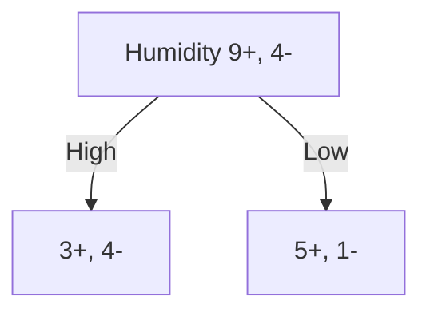

# 5.2 Symbolized Decision Tree
## 5.2.1 Attributes & Purity of Decision
- We want to know which attribute is the best classifier.
- Each attribute can be represented as a node, splitting test sample into 2 classes (in the binary case)
- The *purer* the splitting, the better the decision.

## 5.2.2 Entropy 熵
**[DEF] Entropy 熵**
- Given **a split** from collection $S$ with **portions** of both positive and negative $p_+, p_-$, 
  the entropy of the collection would be:
	- $Entropy(S)=-p_+\log_2p_+-p_-\log_2p_-$
- The higher the entropy, the fewer the information the sample contains.
	- High Entropy = More Messy, Lower Entropy = Less Messy 
	-  ![[2-Split Entropy.png]]
	- $f(p)=-p\log_2p-(1-p)\log_2(1-p)$

**[Prop] Entropy 熵的性质**
- Domain is $[0,1]$;
	- Monotonically, Increase in $p_+\in[0,\dfrac{1}{2}]$, Decrease in $p_+\in[\dfrac{1}{2},1]$ (symmetric in $p_-$);
- Range is $[0,1]$;
	- Reaches the peak at $p=\dfrac{1}{2}$, reaches the lowest point at $p_+=0$ and $p_+=1$.

## 5.2.3 Information Gain
By calculating the difference between
- The entropy **BEFORE** splitting, and
- The entropy **AFTER** splitting,
we can calculate the "Information Gained" from the splitting.
- When calculating, we should also consider the weights, i.e., the significance of each branch.

**Basics**
- Suppose that a collection $S$ has $x=|S|$ samples, separated into $n$ branches $S_1,S_2,\cdots,S_n$. For a specific branch $S_i$, it contains $x_i=|S_i|$ samples.
	- $x=x_1+x_2+\cdots+x_n$
- Among the $x$ samples, there are $x_+$ positive samples and $x_-$ negative samples.
	- $x=x^++x^-$
- For each branch $x_i$, there are $x_+^i$ positive samples and $x_-^i$ negative samples.
	- $x_i=x_i^++x_i^-$
	- Obviously, $x^+=\sum_{i=1}^{n}x_i^+$, and $x^-=\sum_{i=1}^{n}x_i^-$

**Entropy Before Split**
- $p_+=\dfrac{x^+}{x^++x^-}$, $p^-=\dfrac{x^-}{x^++x^-}$
- $Entropy(S)=-p^+\log_2p^+-p^-\log_2p^-$

**Weighted Entropy After Split**
- For each branch $S_i$:
	- $p_i^+=\dfrac{x_i^+}{x_i^++x_i^-}$, $p_i^-=\dfrac{x_i^-}{x_i^++x_i^-}$
	- Weight of this branch $w_i=\dfrac{x_i}{x}=\dfrac{|S_i|}{|S|}$
	- Entropy of this branch $Entropy(S_i)=-p_i^+\log_2p_i^+-p_i^-\log_2p_i^-$
- Total weighted entropy after split:
	- $\sum_{i=1}^{n} \dfrac{x_i}{x}(-p_i^+\log_2p_i^+-p_i^-\log_2p_i^-)$
	- $=\sum_{i=1}^{n}\dfrac{|S_i|}{|S|}Entropy(S_i)$

**Information Gain**
- $Gain(S)=Entropy \ Before \ Split \ - \ Entropy \ After \ Split$
- $=Entropy(S)-\sum_{i=1}^{n}\dfrac{|S_i|}{|S|}Entropy(S_i)$
## 5.2.4 From Entropy to Information Gain
Given:
- A decision node, with the amounts in each class:
	- Collection 1 ($S_1$):
		- Positive: $n_1^{+}$
		- Negative: $n_1^{-}$
	- Collection 2 ($S_2$):
		- Positive :$n_2^{+}$
		- Negative: $n_2^{-}$
- Example:
	- $n_1^+=3, n_1^-=4$
	- $n_2^+=6, n_2^-=1$

Do:
- Get the proportion of positive & negative samples in both collections.
	- $S_1$: 
		- $p_1^+=\dfrac{n_1^+}{n_1^++n_1^-}=\dfrac{3}{3+4}=\dfrac{3}{7}$ 
		- $\ p_1^-=\dfrac{n_-^1}{n_+^1+n_-^1}=\dfrac{4}{3+4}=\dfrac{4}{7}$
	- $S_2$: 
		- $p_2^+=\dfrac{n_2^+}{n_2^++n_2^-}=\dfrac{5}{5+1}=\dfrac{5}{6}$ 
		- $p_2^-=\dfrac{n_2^-}{n_2^++n_2^-}=\dfrac{1}{5+1}=\dfrac{1}{6}$
- Calculate Entropies:
	- Calculate entropy **AFTER** splitting:
		- $Entropy(S_1)=-p_1^+\log_2{p_1^+}-p_1^-\log_2{p_1^-}=-\dfrac{3}{7}\log_2\dfrac{3}{7}-\dfrac{4}{7}log_2\dfrac{4}{7}=0.9852$
		- $Entropy(S_2)=-p_2^+\log_2{p_2^+}-p_2^-\log_2{p_2^-}=-\dfrac{5}{6}\log_2\dfrac{5}{6}-\dfrac{1}{6}log_2\dfrac{1}{6}=0.6500$
	- Calculate overall **BEFORE** splitting:
		- $p^+=\dfrac{n^+}{n^++n^-}=\dfrac{9}{9+4}=\dfrac{9}{13}$
		- $p^-=\dfrac{n^-}{n^++n^-}=\dfrac{4}{9+4}=\dfrac{4}{13}$
		- $Entropy(S)=-p_+log_2{p_+}-p_-log_2{p_-}=-\dfrac{9}{13}\log_2\dfrac{9}{13}-\dfrac{4}{13}\log_2\dfrac{4}{13}=0.8905$
- Calculate Information Gain:
	- $Gain(S)=Entropy(S)-\sum_{i\in\{1,2\}}\dfrac{|S_i|}{|S|}Entropy(S_i)$
	- $=0.8905-(\dfrac{7}{13}\times0.9852+\dfrac{6}{13}\times0.6500)$
	- $=0.0600$

# 5.3 CART
Classification and Regression Tree
A binary tree that can handle numeric inputs and outputs.

## 5.3.1 Gini Index 基尼指数
For a split $S_i$ from collection $S$ that has results with $m$ labels:
- $|S_i|=x_{i1}+x_{i2}+\cdots+x_{im}$

The Gini Index of this split is:
- $Gini(S)=1-\sum_{j=1}^{m}{(p_{ij})}^2$
	- $=1-\sum_{j=1}^{m}(\dfrac{x_{ij}}{x_{i1}+x_{i2}+\cdots+x_{im}})^2$
	- $=1-\dfrac{\sum_{j=1}^{m}x_{ij}^2}{|S_i|^2}$

Reaches maximum when $p_{ij}=\dfrac{1}{m}$
- $Gini(S)_{max}=1-m\times(\dfrac{1}{m})^2=1-\dfrac{1}{m}$
- For a binary case, $Gini(S)_{max}=\dfrac{1}{2}$
![[2-Split Gini Index.png]]
## 5.3.2 Classification Tree (CT)
**Choose A split point $\alpha$**
- To decide the splitting of a continuous node, we need to find the best splitting point that gives an optimized split.
- Sort the continuous value, find the $\alpha$ that gives the lowest entropy, i.e., purity.
### Over Fitting
## 5.3.3 Regression Tree (RT)
Minimize $\sum (x-\bar{x})^2$
### Regression Problem
