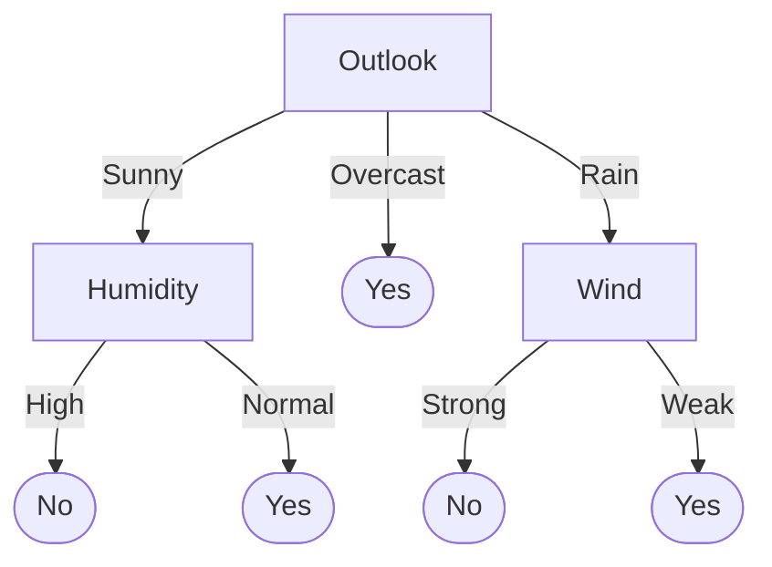
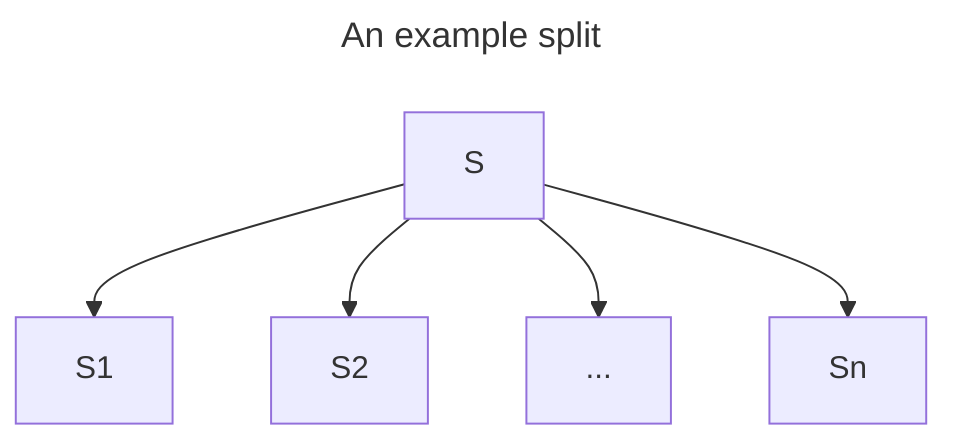
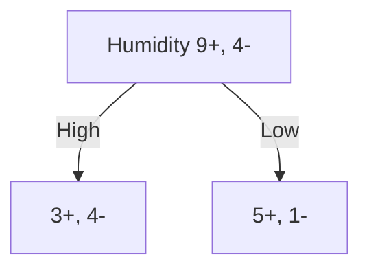

# 5.1 Introduction
## 5.1.1 Properties of DT Learning & DT
- [i] Decision Tree Learning is:
	- A method for inductive inference 归纳推理.
	- A method for approximating discrete-valued functions.
		- Robust to noisy data.
		- Can learn disjunctive expressions.
	- The learned function is represented by a *decision tree*.
		- which also could be represented as *sets of if-then rules*.
### A sample decision tree


- [i] A Decision Tree:
	- Represents a *disjoint* of conjunctions of constraints on the attribute value of instance.
		- disjoint = a set of $\lor$
		- e.g., sample decision tree = $(\text{Outlook}=Sunny\land \cdots)\lor(\text{Outlook}=Overcast\land \cdots)\lor(\text{Outlook}=Rain\land \cdots)$
		- A set of all possible decision paths.
	- Each path from the tree, from root to leaf is a *conjunction* of attribute sets.
		- conjunction = a set of $\land$
		- e.g., the path $\text{Outlook}\rightarrow \text{Humidity}\rightarrow No \equiv \text{Outlook}=Sunny \land \text{Humidity}=High \implies No$

## 5.1.2 How to Test a sample with a DT
**Given**
- A *pre-trained* decision tree that's used to test unseen samples.
- A given sample.
**Do**
- Sort item down the tree, from root to some leaf node.
- For each node in a tree:
	- Specifies *a test of some attribute* of the instance.
		- i.e., $\text{Weather}=Good\lor \text{Weather}=Bad$
- Start the classification of an instance at the *root node*.
	- Then, move down the tree branch to the value in the given example.
	- Repeat this process until we meet a leaf node.
### Example
```
Given: <Sunny, Normal>
Start.
	Look at node "Outlook", Go to branch "Sunny";
	Look at node "Humidity", Go to branch "Normal";
	Look at node "Yes", Leaf Node, conclusion reached.
	Output: Yes.
End.
```

## 5.1.3 Appropriate Problems for DT
1. Instances describable by attribute-value pairs.
	1. e.g., $\text{Temperature}=\text{Hot}$, $\text{Humidity}=\text{High}$, etc.
2. Target function has discrete output values. 离散输出值
	1. e.g., $\text{Yes/No}$, $\text{Is Owner}/\text{Not Owner}$, etc.
3. Disjunctive hypothesis may be required.
	1. That is, the hypothesis is in the format of "xxx or xxx or xxx...."
4. Possibly noisy training data.
5. Missing attribute values in training data.

# 5.2 Measurement of Split Purity
## 5.2.1 DT Learning Algorithm & Purity of Decision
- [i] To generate/learn a decision tree
	- We perform a top-down *greedy search* through the space of possible decision trees.
	- We want to know which attribute of an arbitrary data sample is the best classifier.
		- Each attribute can be represented as a node, splitting test sample into 2 or more possible values on this attribute.
			- $\text{Weather}=Normal \lor \text{Weather}=Good \lor \text{Weather}=Bad$.
		- The *purer* the splitting, the better the node is.
## 5.2.2 Entropy 熵
### Definition
- [i] Entropy measures the homogeneity 同质性 of examples.
	- Given *a split* from collection $S$ with *portions* of both positive and negatives $p_+, p_-$, the **entropy** of the collection would be:
		- $Entropy(S)=-(p_+\log_2p_+)-(p_-\log_2p_-)$
	- The higher the entropy, the fewer the information the sample contains.
		- High Entropy = More Messy, Lower Entropy = Less Messy 

![[2-Split Entropy.png]]
### Properties
- Domain is $[0,1]$;
	- Monotonically, Increase in $p_+\in[0,\dfrac{1}{2}]$, Decrease in $p_+\in[\dfrac{1}{2},1]$ (symmetric in $p_-$);
- Range is $[0,1]$ (for binary classification);
	- Reaches the peak at $p=\dfrac{1}{2}$, reaches the lowest point at $p_+=0$ and $p_+=1$.
### General Case
- [i] Entropy can be applied not only in binary classification, but also classification tasks that target on multiple classes.
- Given a split $S$ that splits an attribute examples into $c$ possible values:
	- $Entropy(S)=\sum_{i=1}^{c}-p_{i}\log_{2}p_{i}$
	- where $p_i$ is the proportion of examples in $S$ that's been given the value $i$ in the attribute.

## 5.2.3 Gini Index 基尼指数
### Definition
- For a split $S_i$ from collection $S$ that has results with $m$ labels:
	- $|S_{i}|=|S_{i}|^{(1)}+|S_{i}|^{(2)}+\cdots+|S_{i}|^{(m)}$
	- $m$-ary classification
- The Gini Index of this split is:
	- $Gini(S_i)=1-\sum_{j=1}^{m}{(p_{ij})}^2$
		- $=1-\sum_{j=1}^{m}\Bigl(\dfrac{|S_{i}|^{(j)}}{|S_{i}|^{(1)}+|S_{i}|^{(2)}+\cdots+|S_{i}|^{(m)}}\Bigr)^2$
		- $=1-\dfrac{\sum_{j=1}^{m}(|S_{i}|^{(j)})^2}{m|S_i|^2}$
- The higher the Gini Index, the fewer the information the sample contains.
	- Same as entropy
### Properties
Reaches maximum when $p_{ij}=\dfrac{1}{m}$
- $Gini(S)_{max}=1-m\times(\dfrac{1}{m})^2=1-\dfrac{1}{m}$
- For a binary case, $Gini(S)_{max}=\dfrac{1}{2}$
<a href="https://sm.ms/image/ZwesPiVSYIx4fuD" target="_blank">
	
</a>

# 5.3 Information Gain
## 5.3.1 Calculation of Information Gain
By calculating the difference between
- The entropy *BEFORE* splitting, and
- The entropy *AFTER* splitting,
we can calculate the **Information Gained** from the splitting.
- When calculating, we should also consider the **weights**, i.e., the significance of each branch.

**Basics**

- Suppose that a collection $S$ has $|S|$ samples, separated into $n$ branches $S_1,S_2,\cdots,S_n$. For a specific branch $S_i$, it contains $|S_i|$ samples.
	- $|S|=|S_1|+|S_2|+\cdots+|S_n|$
- Among the $|S|$ samples, there are $|S|^+$ positive samples and $|S|^-$ negative samples.
	- $|S|=|S|^++|S|^-$
- For each branch $S_i$, there are $|S_i|^+$ positive samples and $|S_i|^-$ negative samples.
	- $|S_i|=|S_i|^++|S_i|^-$
	- Obviously, $|S|^+=\sum_{i=1}^{n}|S_i|^+$, and $|S|^-=\sum_{i=1}^{n}|S_i|^-$

### Step 1. Calculate the Entropy Before Split
- $p^+=\dfrac{|S|^+}{|S|^++|S|^-}$, $p^-=\dfrac{|S|^-}{|S|^++|S|^-}$
- $Entropy(S)=-p^+\log_2p^+-p^-\log_2p^-$

### Step 2. Calculate the Weighted Entropy After Split
- For each branch $S_i$:
	- $p_i^+=\dfrac{|S_{i}|^+}{|S_{i}|^++|S_{i}|^-}$, $p_i^-=\dfrac{|S_{i}|^-}{|S_{i}|^++|S_{i}|^-}$
	- Weight of this branch $w_i=\dfrac{|S_i|}{|S|}$
	- Entropy of this branch $Entropy(S_i)=-p_i^+\log_2p_i^+-p_i^-\log_2p_i^-$

- Total weighted entropy after split:
	- $=\sum_{i=1}^{n}\dfrac{|S_i|}{|S|}Entropy(S_i)$
		- $=\sum_{i=1}^{n} \dfrac{|S_{i}|}{|S|}(-p_i^+\log_2p_i^+-p_i^-\log_2p_i^-)$

### Step 3. Calculate Information Gain
- $Gain(S)=\text{Entropy \ Before \ Split} \ - \text{\ Entropy \ After \ Split}$
	- [*] $=Entropy(S)-\sum_{i=1}^{n}\dfrac{|S_i|}{|S|}Entropy(S_i)$
## 5.3.2 Calculate Info Gain: An example
**Given**
- A decision node, with the amounts in each class:
	- Collection 1 ($S_1$):
		- Positive: $n_1^{+}$
		- Negative: $n_1^{-}$
	- Collection 2 ($S_2$):
		- Positive :$n_2^{+}$
		- Negative: $n_2^{-}$
- Example:
	- $n_1^+=3, n_1^-=4$
	- $n_2^+=6, n_2^-=1$

**Do**
- Get the proportion of positive & negative samples in both collections.
	- $S_1$: 
		- $p_1^+=\dfrac{n_1^+}{n_1^++n_1^-}=\dfrac{3}{3+4}=\dfrac{3}{7}$ 
		- $\ p_1^-=\dfrac{n_-^1}{n_+^1+n_-^1}=\dfrac{4}{3+4}=\dfrac{4}{7}$
	- $S_2$: 
		- $p_2^+=\dfrac{n_2^+}{n_2^++n_2^-}=\dfrac{5}{5+1}=\dfrac{5}{6}$ 
		- $p_2^-=\dfrac{n_2^-}{n_2^++n_2^-}=\dfrac{1}{5+1}=\dfrac{1}{6}$
- Calculate Entropies:
	- Calculate entropy **AFTER** splitting:
		- $Entropy(S_1)=-p_1^+\log_2{p_1^+}-p_1^-\log_2{p_1^-}=-\dfrac{3}{7}\log_2\dfrac{3}{7}-\dfrac{4}{7}log_2\dfrac{4}{7}=0.9852$
		- $Entropy(S_2)=-p_2^+\log_2{p_2^+}-p_2^-\log_2{p_2^-}=-\dfrac{5}{6}\log_2\dfrac{5}{6}-\dfrac{1}{6}log_2\dfrac{1}{6}=0.6500$
	- Calculate overall **BEFORE** splitting:
		- $p^+=\dfrac{n^+}{n^++n^-}=\dfrac{9}{9+4}=\dfrac{9}{13}$
		- $p^-=\dfrac{n^-}{n^++n^-}=\dfrac{4}{9+4}=\dfrac{4}{13}$
		- $Entropy(S)=-p_+log_2{p_+}-p_-log_2{p_-}=-\dfrac{9}{13}\log_2\dfrac{9}{13}-\dfrac{4}{13}\log_2\dfrac{4}{13}=0.8905$
- Calculate Information Gain:
	- $Gain(S)=Entropy(S)-\sum_{i\in\{1,2\}}\dfrac{|S_i|}{|S|}Entropy(S_i)$
	- $=0.8905-(\dfrac{7}{13}\times0.9852+\dfrac{6}{13}\times0.6500)$
	- $=0.0600$

# 5.4 CART

## 5.4.0 What is CART?
- Classification and Regression Tree.
- A **binary tree** that can handle numeric inputs and outputs.

## 5.4.0 Recursive Partitioning
**Given**
- A set of training samples:
	- $\mathbf{X}=\{\mathbf{x}_{1},\mathbf{x}_{2},\dots,\mathbf{x}_{n}\}$, where
		- $\mathbf{x}_{i}=\begin{bmatrix}x_{i1} & x_{i2} & \cdots & x_{im}\end{bmatrix}$, where $x_{ij}$ is the $j$-th variable of data sample $\mathbf{x}_{i}$.
- A mapping relation that labels the training samples.
	- $c:\mathbf{X}\mapsto \mathbf{y}$
**Do**
- For all variables $x_{ij}$ in an arbitrary data sample $\mathbf{x}_{i}$,
	- Split all data samples $\mathbf{X}$ into *two* portions with respect to $x_{ij}$.
		- [I] Different variable types (categorical/numerical) has their own dedicated way to split specifically into *two* portions.
	- Measure how *pure* this split is.
- Select the variable $x_{ij}$ that gives the purest split.
- Repeat the above process for a second split, and so on.

## 5.4.1 Classification Tree (CT)
### How to split continuous variable?
- Sort the continuous variable.
- Find all separation mid-points that separates the continuous variable into lower and higher parts.
	- For instance, for a set of continuous values $14.0, 14.8, 16.0$, we inspect $14.4, 15.4$, which are the mid points of the above set.
- Select the separation point $\alpha$ that gives the best purity.
### How to split categorical variable?
- Examine all possible ways in which the categories can be split.
- For example, for each possible category $A$, $B$ and $C$, it could be split 3 ways:
	- $A$ and $BC$
	- $B$ and $AC$
	- $C$ and $AB$
- Find the split that gives the best purity.
### E(5.4.1) Example
A task to classify if an email is spam or not.

| Word Count | Sender's Email | Contain word "Free" | Spam |
| ---------- | -------------- | ------------------- | ---- |
| 100        | Edu            | Yes                 | Yes  |
| 200        | Com            | Yes                 | No   |
| 800        | Edu            | Yes                 | No   |
| 60         | Org            | No                  | Yes  |
| 40         | Edu            | No                  | Yes  |
| 300        | Org            | No                  | Yes  |
| 300        | Edu            | Yes                 | No   |
| 300        | Com            | Yes                 | No   |
#### E(5.4.1)-1 Word Count (Numerical)
**1. Sort the word count.**
`40, 60, 100, 200, 300, 300, 300, 800`
`Y,  Y,   Y,   N,   Y,   N,   N,   N`

**2. Find $\alpha$**
Entropy Before Split:
$E=-\dfrac{4}{8}\log_2{\dfrac{4}{8}}-\dfrac{4}{8}\log_2{\dfrac{4}{8}}=1$

Entropy After Split for each separation points:
- `40|60`, $\alpha=\dfrac{40+60}{2}=50$.
	- $<50$:  $+:1$, $-:0$,    $E_{x<50}= -1\log_2{1}-0\log_2{0} = 0$
	- $>50$:  $+:3$, $-:4$,    $E_{x>50}=-\dfrac{3}{7}\log_2{\dfrac{3}{7}}-\dfrac{4}{7}\log_2{\dfrac{4}{7}}=0.9852$
	- $IG_{\alpha=50}=1-(\dfrac{1}{8}\times0+\dfrac{7}{8}\times0.9852)=0.13795$

- `60|100`, $\alpha=\dfrac{60+100}{2}=80$.
	- $<80$:  $+:2$, $-:0$    $E_{x<80}= -1\log_2{1}-0\log_2{0} = 0$
	- $>80$:  $+:2$, $-:4$    $E_{x>80}= -\dfrac{2}{6}\log_2{\dfrac{2}{6}}-\dfrac{4}{6}\log_2{\dfrac{4}{6}} = 0.9183$
	- $IG_{\alpha=80}=1-(\dfrac{2}{8}\times0+\dfrac{6}{8}\times0.9183)=0.311275$

- `100|200`, $\alpha=\dfrac{100+200}{2}=150$.
	- $<150$:  $+:3$, $-:0$     $E_{x<150}= -1\log_2{1}-0\log_2{0} = 0$
	- $>150$:  $+:1$, $-:4$     $E_{x>150}= -\dfrac{1}{5}\log_2{\dfrac{1}{5}}-\dfrac{4}{5}\log_2{\dfrac{4}{5}} = 0.7219$
	- $IG_{\alpha=150}=1-(\dfrac{3}{8}\times0+\dfrac{5}{8}\times0.7219)=0.5488125$

- `200|300`, $\alpha=\dfrac{200+300}{2}=250$.
	- $<250$:  $+:3$, $-:1$   $E_{x<250}= -\dfrac{3}{4}\log_2{-\dfrac{3}{4}}-\dfrac{1}{4}\log_2{\dfrac{1}{4}} = 0.8113$
	- $>250$:  $+:1$, $-:3$   $E_{x>250}= -\dfrac{1}{4}\log_2{\dfrac{1}{4}}  -\dfrac{3}{4}\log_2{-\dfrac{3}{4}}= 0.8113$
	- $IG_{\alpha=250}=1-(\dfrac{4}{8}\times0.8113+\dfrac{4}{8}\times0.8113)=0.1887$

- `300|800`, $\alpha=\dfrac{300+800}{2}=550$.
	- $<550$:  $+:4$, $-:3$   $E_{x<550}= -\dfrac{4}{7}\log_2{-\dfrac{4}{7}}-\dfrac{3}{7}\log_2{\dfrac{3}{7}} = 0.9852$
	- $>550$:  $+:0$, $-:1$   $E_{x>550}= -0\log_2{0}-1\log_2{1} = 0$
	-  $IG_{\alpha=550}=1-(\dfrac{7}{8}\times0.9852+\dfrac{1}{8}\times0)=0.13795$

We can see that $\alpha=150$ that separates $60$ and $100$ gives the best split. Therefore, for the node $\text{Word \ Count}$, we choose $\alpha=150$, and $IG=0.5488125$ as the Information Gain of the root node.
#### E(5.4.1)-2 Sender's Email (Categorical)
- Find all the possible splits.
	- $\{Edu\}: +:2, -:2$
	- $\{Com\}:  +:0, -:2$
	- $\{Org\}:  +: 2, -:0$

1. $\{Edu\}\cup\{Com, Org\}$
	1. $\{Edu\}$:  $+:2, -:2$,               $Entropy=1$
	2. $\{Com, Org\}$:  $+:2, -:2$,      $Entropy=1$
	3. $IG=1-(\dfrac{4}{8}\times1+\dfrac{4}{8}\times1)=0$
2. $\{Com\}\cup\{Edu, Org\}$
	1. $\{Com\}:  +:0, -:2$               $Entropy=0$
	2. $\{Edu, Org\}: + 4, -:2$           $Entropy=-\dfrac{4}{6}\log_2{\dfrac{4}{6}}-\dfrac{2}{6}\log_2{\dfrac{2}{6}}=0.9183$
	3. $IG=1-(\dfrac{2}{8}\times0+\dfrac{6}{8}\times0.9183)=0.311275$
3. $\{Org\}\cup\{Edu, Com\}$
	1. $\{Org\}:  +:2, -:0$                 $Entropy=0$
	2. $\{Edu, Org\}: + 2, -:4$           $Entropy=-\dfrac{2}{6}\log_2{\dfrac{2}{6}-\dfrac{4}{6}\log_2{\dfrac{4}{6}}}=0.9183$
	3. $IG=1-(\dfrac{2}{8}\times0+\dfrac{6}{8}\times0.9183)=0.311275$

Both split $\{Com\}\cup\{Edu, Org\}$ and $\{Org\}\cup\{Edu, Com\}$ gives the highest information gain, which is $0.311275$. Therefore, the information gain of $Sender's \ Email$ is $0.311275$ for the root node.
#### E(5.4.1)-3 Contain word "Free" (Binary)
Binary Classification plays the same.
- $Yes$:
	- $+:1, -:4$     $Entropy=-\dfrac{1}{5}\log_2{\dfrac{1}{5}}-\dfrac{4}{5}\log_2{\dfrac{4}{5}}=0.7219$
- $No$:
	- $+:3, -:0$     $Entropy=0$
- $IG=1-(\dfrac{5}{8}\times0.7219+\dfrac{3}{8}\times0)=0.5488125$
#### E(5.4.1)-Generally
- $IG(\text{Word \ Count})=0.5488125$ with $\alpha=150$;
- $IG(\text{Sender's \ Email})=0.311275$;
- $IG(\text{Contain \ Word "Free"})=0.5488125$
Therefore, use $\text{Word Count}$ or $\text{Contain Word "Free"}$ as the root node.
## 5.4.2 Over Fitting and Pruning 过拟合与剪枝
### Overfitting
- Natural end of process is 100% purity in each leaf
- Overfits: Fits to the data too well that it even fits the noise data!
- Result in: Low predictive accuracy of new data
	- The error rate of **validation data** starts to increase after a certain number of splits.
### Pruning
- CART lets the tree grow freely, and prune it back
	- Allow some error.
	- Find the exact point at which the validation error begins to rise.
	- Generate successively smaller trees by pruning leaves.
		- At each pruning stage, multiple trees are possible.
		- Use **cost complexity** to choose the best tree at that stage.
- Choose the best tree at each pruning stage by using Cost Complexity
	- $CC(T) = Err(T) + \alpha L(T)$
		- $CC(T)$ - Cost Complexity of a tree.
		- $Err(T)$ - Proportion of mis-classified results, i.e., error rate.
		- $\alpha$ - a penalty factor attached to tree size
## 5.3.3 Regression Tree (RT)
- Used with continuous outcome variable
- Procedure similar to classification tree:
	- Attempt many splits, choose the one that minimizes impurity
	- Measure impurity by: $\sum (x-\bar{x})^2$
# 5.4 Pros and Cons
## Advantages of Trees
- Easy to use and understand
	- Produces rules that are easy to interpret & implement
- Automatic selection of variables
	- Do not require the assumptions of statistical models
	- Can work without extensive handling of missing data

## Disadvantages
- May not perform well when:
	- There is a structure in the data that can't be well captured by horizontal and vertical splits.
- Can't capture interactions between variables.
